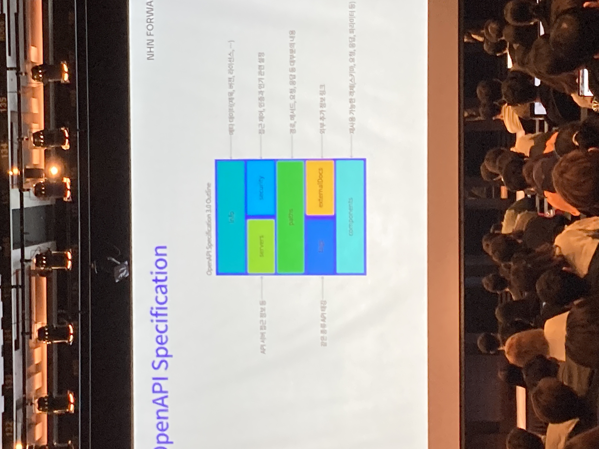

# 2. API Specification

## API 우선 방식

상품 서비스의 가장 중요한 자산 전략으로 api를 가장 중요하게 고려하는 방식이다. Api 중심 개발을 통해 인프라와 서비스단까지 효율적인 설계가 가능하다. Api가 서비스에서 차지하는 비중에 따라 결정될 수 있다. Api는 서비스의 전략이자 목표이다.

**코드 우선 방식**

문제 해결을 위한 비즈니스 로직부터 개발하고 api는 마지막에 개발하는 방식이다. Api는 서비스를 제공하는 하나의 전술 중 하나이다.

## API 설계 우선

Api우선 방식의 고도화된 버전이고 더 구체적인 방식이다. 접근법보다는 방법론의 차이이다.

### Contract

API 설계 문서를 의미하고, 이가 약속되지 않으면 다음 단계로 진행하지 않는다.

### 장점

더 빠른 출시가 가능하며 개발자 경험 개선이 가능하고 의사소통 개선이 가능했다. 또한, api개발자가 문서화를 통해 sdk를 자동생성하고 클라이언트 개발자는 이를 바로 사용해볼 수 있다.

## OpenAPI Specification

Api 설계 표준 인터페이스로 사실상 디팩토 스탠다드임

### Vs swagger

스웨거는 specification을 구현한 하나의 구현체이다.

### 특징

- 사람과 기계 모두 이해할 수 있는 API
  Yaml과 json으로 api contract를 선언하고 상호간의 약속을 통해 다음 단계로 나아간다.

### Outline

## 시행과 착오

### **용어통일**

다양한 서비스를 통합하기 위해 api를 사용하는 경우 도움이 될 사례이다. 대부분 메시지 발송이 api로 이루어지므로 OpenApi Specification 방식을 채택하였음. 파편화된 각각의 서비스를 통합하여야 했다. Api facade를 통해 사용자 친화적인 api를 통합했다. 하지만 그 전, 용어의 통일이 필요했다.

### 설계 문서 관리

설계하는 api가 많아지면 문서가 매우 길어지는 문제가 발생했다. 이는 json reference를 통해 응답, 요청, 본문을 분리했다. 그렇지만 버저닝을 생각하면 아직 멀었다. Api 정의 파일도 버저닝을 통해 정의하고 이를 최상위 contract에서 참조하는 방식으로 해결했다.

Path 객체 하위에 json reference를 통해 참조하기를 희망했지만, 스펙상 path 객체 하위에는 레퍼런스를 둘 수 없었다. 따라서 기각됨. 하지만 path item 객체에서 레퍼런스를 사용해 분리해 사용했다.

아직 적용 결론이 나지 않았다.

### 확장

프로그래밍 언어에 독립적이어서 특정 언어에 맞는 기능을 제공하기가 어렵다. OpenApi Specification은 bean validation을 제공하지 않아 어려운 점이 있었다. 익스텐션 기능을 활용해서 추가 구현이 필요했다. X- 을 통해 확장 필드를 생성하였으며 작성된 api 명세가 generator를 통해 코드를 상성될 때 Mustache라는 템플릿 언어를 통해 확장이 가능했다.

### 오류

잘 못들었음. spring에 국한된 느낌이라 와닿지 않았음.
