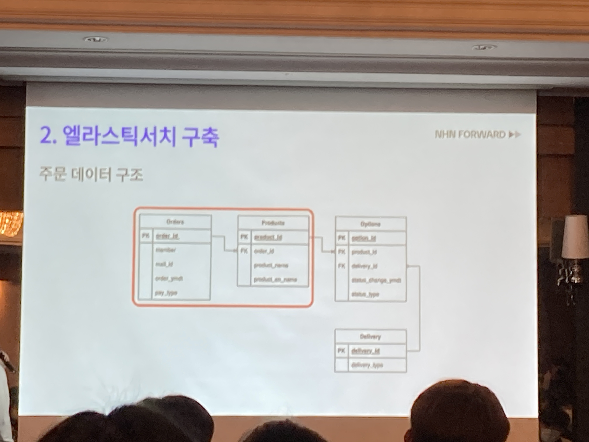

# 샵바이 주문 검색 성능 개선기

애증의 엘라스틱 서치

## 검색엔진을 도입한 이유

기존에는 RDB기반으로 처리하고 있었지만 속도가 느려졌다. 1달치 조회에 20초 정도 소요되었다. 즉 늘어난 데이터양을 빠르게 조회할 수 있는 방법이 필요했다.

인덱스를 태운 데이터 양도 많아 정렬 처리에 긴 시간이 소요되었고 주문 데이터가 복잡해 쿼리가 복잡했고 이를 해결하기 위해 후보군으로 엘라스틱서치, 솔라, 스핑크스를 추려냈다.

**낙오 검색엔진의 단점**

- 솔라: 낮은 인덱싱 성능으로 실시간성 보장에 어려움
- 스핑크스: 검색속도도 빠르고 리소스도 적게 먹으나 레퍼런스가 적어 개발하고 유지보수하는데 어려움

**엘라스틱서치**

- 빠른 검색속도와 상당히 많은 유지보수 자료

## 검색엔진 도입의 과정 (구축)

### 주문데이터의 구조

각각의 상품이 있고, 그 아래 옵션이 있으며, 옵션단위로 장바구니 DB에 추가되게 된다. 그리고 이를 통해 주문까지 이어진다. 그리고 배송에서는 각각의 옵션을 단위로 묶어 배송지를 나눠줄 수 있게 되어 있다.

### 인덱스 모델링

주문과, 배송을 주로 인덱스를 생성하기로 하였고, 조건에 있는 최소한의 데이터를 추가하게 되었다. 조건들과 필드들을 각 인덱스에 넣어주기로 했다.

상세데이터의 경량화는 조회한 key값으로 DB를 조회하는 방식으로 진행하였다. 데이터의 경량화를 위해 상세정보는 index에 넣지 않았다.

**Nested모델링**

1:N의 계층 구조를 배열형식으로 저장하는 방식을 사용했다. nestedType의 객체는 별도의 **Document**로 생성되며 1:N 구조의 RDB테이블을 직관적으로 모델링할 수 있다. 하지만 주문구조는 1:N의 관계중첩이 많아 성능에 영향을 끼치고 구현 쿼리가 복잡해질 수 있다.

**비정규형 모델링**

계층구조의 모델을 flatten시켜서 구현하는 방식이다. 하지만 페이지네이션과 카운팅의 처리가 어려워 바로 사용할 수가 없었다.

즉, 두 모델링을 섞어서 사용함

order는 nested모델로 하고 나머지 연관 데이터는 flatten해서 저장해 쿼리 구조를 쉽게 만들었다.

### 동기화 전략

동기화의 누락을 막기 위한 전략

**실시간 동기화**

- KafkaConnect
  RDB의 정보를 긁어서 엘라스틱서치에 넣어준다. KafkaConnect를 우선적으로 고려했다. Kafka에 플러그인형태로 설치하고 데이터를 조회할 쿼리와 주기를 넣고 돌린다. 그리고 이 카프카 메시지를 컨슘해서 엘라스틱서치로 동기화 하는 방식으로 진행했다. 하지만 사용하지 않았다.
  설정값을 바꿀 때마다 카프카를 담당하는 DevOps에 지원요청을 했다. 그리고 문서가 적고 커스터마이징에 어려운 문제가 있었다.
- 동기화 스케쥴러
  5초에 한번씩 DB에 데이터를 조회하여 동기화 한다. 중복동기화 데이터는 있을 수 있지만 누락을 최소화할 수 있을 것 같았으나 누락이 발생했다. 트랜잭션이 길어졌을 때, 동기화 시간대에 적용이 되었지만 커밋시간이 동기화 시간 이후로 잡힌다면 스케쥴러 동작에 문제가 생긴다.
  ⇒ 즉 동기화 시점에 커밋되지 않은 데이터가 있을 때 발생하는 문제로 커밋되지 않은 데이터도 조회하여 다음 동기화 때 해당 데이터도 포함하여 수정한다. 다만 커밋되지 않은 데이터의 updatedAt을 다음 시점에 포함시켜 배치가 돌도록 했음.

**수동 동기화 배치**

파라메터로 기간을 받아 누락된 데이터를 모두 탐색한다.

**************\*\***************데이터 검증 배치**************\*\***************

누락 여부를 자동으로 확인하는 알림배치를 개발함.

### 쿼리구현

엘라스틱서치에서 key count 조회후 key 값으로DB에서 세부정보를 조회함.

**시행착오**

10001번 주문에 [바지(배송준비), 구두(배송중), 후드티(배송중)]가 있다고 치고, 배송중인 바지를 검색했을 때, 10001번 주문이 포함되어서 내려오게 되는 문제가 존재했다. nested 모델링에서는 조건을 nested로 적용해야 한다. 즉 하위 필드의 조건은 함께 적용되어야 한다. 그리고 nested 모델링에 대해서 **중첩 수준은 낮게** 구현해야 한다. **쿼리 구현난이도가 높고** 중첩이 많아지면 **쿼리가 정상적으로 동작하지 않음**.

## 도입 후 결과

> 중요한건 정확한 데이터

검색은 속도가 아닌 정확성이 중요하다.

1000만건 검색시 성능이 0.4초로 성능향상 → 캐싱되지 않을때 가끔 1초까지 뜀

## 질문

1. 상품명에 대한 아날라이저는 어떻게 사용하였나요?

   standard를 썼고 keyword에 와일드카드를 썼다.
