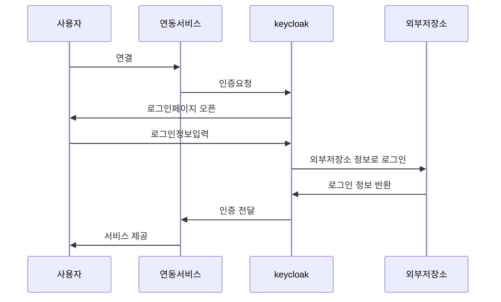

# keycloak

> 오픈소스 인증 서비스

## 왜 keycloak인가

외부 솔루션으로 구축된 legacy SSO를 사용중이었으나 apache를 사용하지 않은 서비스에는 연동이 불가했다. 다만, 새로 구축된 서비스가 외부망에서의 SSO가 필요로하게 되어 내부망 기준으로 구축된 SSO를 사용할 수 없게 되었다. 이로인해 CAS의 도입으로 외부망 로그인을 지원하기 시작했다.

다중 SSO를 이용하면서 다중 계정을 임직원이 관리해야 하는 문제가 생겼다. CAS가 외부솔루션 로그인을 지원하는 것은 오픈소스라 가능했으나, 외부솔루션은 수정이 불가해 연동에서 실패했다.

새로운 인증서버를 구축하기로 하고 솔루션을 잡았다. 오픈소스가 가능할 것, 다양한 서비스를 지원할 것을 기준으로 서비스를 찾기 시작했다.

****\*\*\*\*****후보군****\*\*\*\*****

- **Keycloak -JAVA (관심도가 높고 대중적임)**
- CAS - JAVA (관심도가 낮음)
- Identity Server - C# (언어가 C#이라 불리함)

## keycloak

### 구조

keycloak → relm → relm별 sso가 존재함 relm별로 client로 존재하고 각 연동 서비스를 하나의 client에 매핑하여 사용하였다. 왜냐하면 application 별로 세부 설정을 나눌 수 있기 때문이다.

### 로그인 과정

### UserStorage Federation

외부 저장소에 존재하는 유저의 정보로 로그인을 진행함

- **LDAP (추가 개발공수가 없음, 기존 SSO에서 LDAP 연동이 이미 되고 있었음)**
- Kerberos
- User Storage SPI (사용자가 직접 모듈을 개발해 keycloak에 적용하는 방식)

### Authentication SPI

로그인 후처리 로직을 수정하는데 NHN은 사용했다. 기존 SSO에서 지원하던 기능이 keycloak에서 지원하지 않아 추가하였음.

**추가한 기능**

1. 다중 ID를 통해 로그인 (사원번호, 이메일 로컬 파트, 로그인 ID)
2. 5회 비밀번호 오류시 계정 잠금 (긴 시간이라도 5번 틀리면 잠기도록 하는 기능을 원했음)
3. 임시 잠금계정 로그인 시도 (로그인 페이지에서 잠금값이 있다면 비밀번호 변경 페이지로 이동하도록 수정)
4. 관리자의 계정 잠금 기능

**how to add SPI**

관리자 페이지에서 인증 흐름을 조회할 수 있다. 이때 기본 인증 흐름을 제외한 부분에 개발한 SPI 모듈을 집어 넣음으로써 인증 흐름을 관리할 수 있다.

## keycloak 연동 방식

### OpenID Connect 방식

SAML보다 최근에 나온 방식이고, keycloak 가이드에서도 해당 방식을 권장한다는 문구가 적혀 있어 사용했다.

**Spring Security Adapter**

프로젝트 버전의 jdk버전이 8 이하인 경우 존재하여 사용할 수 없게 되어, 새 어댑터를 사용하게 되었다.

**mod_auth_openidc Apache HTTPD Module**

기존 사내서비스가 apache를 많이 사용하고 있어서 해당 모듈을 선택했다. 이때 CentOS에 따라 설치하지 못하는 부분과 버그가 생겼다. 이는 서버의 OS를 CentOS7으로 업그레이드 하는 일정이 포함되어 있어 해결되었다.

### SAML방식

인증 심사로 인해 SAML방식을 사용해야 한다는 요청이 와서 결과적으로 병행 하게 되었다.

**JAVA Servlet Filter Adapter**

아직 큰 문제점을 찾지 못했다.

## Release Issue

### 서버 환경 구성

단일서버 구성에서는 별다른 어려움 없이 동작하지만, 다중 서버 구성이 된다면 문제가 발생할 수 있다. 다중서버 환경에서는 각자의 인증모듈을 가지고 있지만, keycloak서버는 이미 인증된 사용자에 대한 인증 요청이 다시 들어오는 문제가 발생한다.

**********\*\*\*\***********redis 적용**********\*\*\*\***********

redis 적용을 통해 세션 공유를 통한 인증 정보 공유가 가능했다. 단, 단일 redis cluster로..

### 쿠키 공유

https에서 생성한 쿠키를 http 통신에서 사용할 수 없다. secure한 쿠키를 위한 해결방안은 아래와 같다.

**정책적으로 모두 HTTPS를 적용하자**

사내의 여러 서비스에 일괄적으로 적용해야 하기에 사전 이해관계와 얽힌 문제가 많았었다.

**************************\*\*\*\***************************쿠키 생성시 http에서 생성**************************\*\*\*\***************************

https의 보안 하위호환은 가능하므로 Secure 하지 않기 때문에 보안에 **취약하다. 따라서 추천하지 않는다.**

**쿠키의 대체세션**

인증 공유를 위한 redis를 적극 활용한다.

### 고놈의.. 레거시

전환 대상의 100건 이상 중 30%가 레거시 시스템이었고 “못해요”의 응답이 대부분이었다. 구축단계에서 전략을 수립하고 LegacySystem 지원을 위한 추가개발을 진행했다.

## 개선 방향

### 인증 보안 강화

- 로그인 모니터링 기능 추가
- 2단계 인증
- 인증 강제 종료

### 잦은 버전 업데이트

2개월 단위로 업데이트 진행하고 1년 사이에 major가 4버전 올라감.

릴리즈노트를 예의주시하면서 버전업그레이드를 신중하게..

## etc…

### IDC 이중화

인증이 shutdown 되면 사내서비스가 다 죽음. (user서비스 ㅎㅇ?)

### 인증 중복 체크

보안 신뢰 상승, 외부 심사 대응
